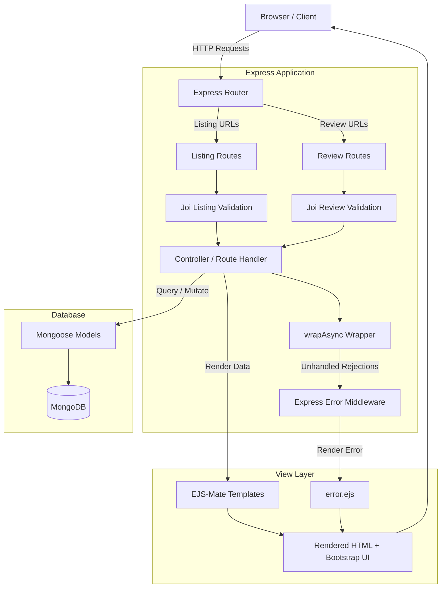

# 🏡 WanderLust — Airbnb Clone

[](https://nodejs.org/)
[](https://expressjs.com/)
[](https://www.mongodb.com/)
[](https://getbootstrap.com/)
[](https://opensource.org/licenses/ISC)
[](https://github.com/darshak767/Airbnb)

**WanderLust** is a full-stack accommodation marketplace web application inspired by **Airbnb**. Built with **Node.js**, **Express 5**, **MongoDB**, **Mongoose**, **EJS**, and **Bootstrap 5**, it provides a platform for browsing, creating, and managing rental listings and guest reviews with robust validation and error handling.

---

## 📑 Table of Contents

- [Overview](#-overview)
- [Key Features](#-key-features)
- [Tech Stack](#-tech-stack)
- [Application Architecture](#-application-architecture)
- [Data Models & Schema](#-data-models--schema)
- [API & Route Directory](#-api--route-directory)
- [Folder Structure](#-folder-structure)
- [Getting Started](#-getting-started)
  - [Prerequisites](#prerequisites)
  - [Installation](#installation)
  - [Environment Variables](#environment-variables)
  - [Database Seeding](#database-seeding)
  - [Running the App](#running-the-app)
- [Validation & Error Handling](#-validation--error-handling)
- [Roadmap](#-roadmap)
- [Contributing](#-contributing)
- [License](#-license)

---

## 📌 Overview

WanderLust provides a complete rental marketplace experience where users can discover properties across various locations, inspect detailed listing specifications (price, location, country, images), leave ratings and written reviews, and publish their own listings.

The project follows the **MVC (Model-View-Controller)** pattern with server-side rendering via **EJS** and layout templating with **EJS-Mate**. It incorporates defensive backend programming with **Joi** schema validation and custom asynchronous error management.

---

## ✨ Key Features

| Category | Feature | Status | Description |
|---|---|:---:|---|
| **Listings** | Browse All Listings | ✅ | Responsive card grid displaying all properties |
| **Listings** | Listing Details View | ✅ | Detailed view with description, pricing, location, and reviews |
| **Listings** | Create Listing | ✅ | Form with client & server-side validation |
| **Listings** | Edit & Update | ✅ | Pre-populated edit form with PUT method override |
| **Listings** | Delete Listing | ✅ | Remove listing with automatic cascading deletion of linked reviews |
| **Reviews** | Add Review | ✅ | 1–5 star rating system with detailed text feedback |
| **Reviews** | Delete Review | ✅ | Remove individual reviews using Mongoose `$pull` operator |
| **Validation**| Schema Validation | ✅ | Strict request validation powered by Joi middleware |
| **Validation**| Client Validation | ✅ | Instant Bootstrap form feedback before submission |
| **Errors** | Custom Error Pages | ✅ | Centralized Express error handler rendering dedicated `error.ejs` |
| **Security** | Auth & Permissions | 🔄 | User registration, login, session cookies, and route guards |
| **Media** | Cloud Image Upload | 🔄 | Cloudinary / AWS S3 image storage integration |
| **Search** | Filter & Geolocation | 🔄 | Live search filters and interactive Mapbox integration |

---

## 🛠️ Tech Stack

### Backend
- **Runtime:** [Node.js](https://nodejs.org/) (LTS recommended)
- **Framework:** [Express.js v5](https://expressjs.com/)
- **Database ODM:** [Mongoose v9](https://mongoosejs.com/)
- **Schema Validation:** [Joi](https://joi.dev/)
- **Utilities:** `dotenv` (environment variables), `method-override` (RESTful PUT/DELETE in HTML forms)

### Frontend
- **Templating Engine:** [EJS](https://ejs.co/) with [EJS-Mate](https://github.com/JacksonTian/ejs-mate) layouts
- **Styling & Components:** [Bootstrap 5](https://getbootstrap.com/)
- **Icons:** [Font Awesome](https://fontawesome.com/)
- **Client Scripting:** Vanilla JavaScript (Form validation & UI interactions)

### Database
- **Database:** [MongoDB](https://www.mongodb.com/) (Local Community Server or MongoDB Atlas)

### Development Tools
- **Hot Reloading:** [Nodemon](https://nodemon.io/)
- **Version Control:** [Git](https://git-scm.com/) & [GitHub](https://github.com/)

---

## 🧠 Application Architecture

The application adopts the classical MVC architecture:



---

## 🗃️ Data Models & Schema

### 1. Listing (`models/listing.js`)

```javascript
{
  title: { type: String, required: true },
  description: String,
  image: {
    filename: { type: String, default: "listingimage" },
    url: { type: String, default: "/img/albert.jpg" }
  },
  price: { type: Number, required: true, min: [0, "Price cannot be negative"] },
  location: { type: String, required: true },
  country: { type: String, required: true },
  reviews: [
    {
      type: Schema.Types.ObjectId,
      ref: "Review"
    }
  ]
}
```

> **Cascading Delete Hook:**
> When a listing is deleted via `findByIdAndDelete`, a Mongoose `findOneAndDelete` post-hook triggers to remove all associated reviews from the database:
> ```javascript
> listingSchema.post("findOneAndDelete", async function (doc) {
>   if (doc) {
>     await Review.deleteMany({ _id: { $in: doc.reviews } });
>   }
> });
> ```

### 2. Review (`models/review.js`)

```javascript
{
  comment: { type: String, required: true },
  rating: { type: Number, min: 1, max: 5, required: true },
  createdAt: { type: Date, default: Date.now() }
}
```

---

## 🌐 API & Route Directory

### Listing Endpoints (`/listings`)

| Method | Endpoint | Description | Middleware |
|---|---|---|---|
| `GET` | `/listings` | List all accommodations | — |
| `GET` | `/listings/new` | Render create-listing form | — |
| `POST` | `/listings` | Persist a new accommodation | `validateListing`, `wrapAsync` |
| `GET` | `/listings/:id` | View accommodation details & reviews | `wrapAsync` |
| `GET` | `/listings/:id/edit` | Render listing edit form | `wrapAsync` |
| `PUT` | `/listings/:id` | Update accommodation details | `validateListing`, `wrapAsync` |
| `DELETE` | `/listings/:id` | Remove accommodation & its reviews | `wrapAsync` |

### Review Endpoints (`/listings/:id/reviews`)

| Method | Endpoint | Description | Middleware |
|---|---|---|---|
| `POST` | `/listings/:id/reviews` | Create and attach a new review | `validateReview`, `wrapAsync` |
| `DELETE` | `/listings/:id/reviews/:reviewId` | Delete a review & unlink from listing | `wrapAsync` |

### Auxiliary Endpoints

| Method | Endpoint | Description |
|---|---|---|
| `GET` | `/` | Root verification route |
| `GET` | `/privacy` | Privacy policy page |
| `GET` | `/terms` | Terms of service page |

---

## 📂 Folder Structure

```
Air bnb/
├── app.js                  # Main server entrypoint & middleware configuration
├── package.json            # Node.js project manifest & scripts
├── package-lock.json       # Deterministic dependency tree
├── schema.js               # Joi validation schemas (Listing & Review)
├── .env                    # Environment variables (Ignored by Git)
├── .gitignore              # Git ignore rules
│
├── init/                   # Database seeding scripts
│   ├── data.js             # Sample accommodations array
│   └── index.js            # MongoDB seed execution script
│
├── models/                 # Mongoose schemas and models
│   ├── listing.js          # Listing model with cascading delete hooks
│   └── review.js           # Review model
│
├── routes/                 # Express modular routers
│   ├── listing.js          # Listing resource routes
│   └── review.js           # Review resource routes (nested mergeParams)
│
├── utils/                  # Utility classes & error helpers
│   ├── ExpressError.js     # Custom error class extending Error
│   └── wrapAsync.js        # Asynchronous function wrapper
│
├── views/                  # EJS server templates
│   ├── layouts/
│   │   └── boilerplate.ejs # Master layout template
│   ├── includes/
│   │   ├── navbar.ejs      # Top navigation bar
│   │   └── footer.ejs      # Bottom footer
│   ├── listings/
│   │   ├── index.ejs       # All listings card gallery
│   │   ├── show.ejs        # Single listing details & reviews
│   │   ├── new.ejs         # Create listing form
│   │   └── edit.ejs        # Edit listing form
│   └── error.ejs           # Error display page
│
└── public/                 # Static assets
    ├── css/
    │   └── style.css       # Custom stylesheet
    ├── js/
    │   └── script.js       # Client validation scripts
    └── img/
        └── albert.jpg      # Fallback listing placeholder
```

---

## 🚀 Getting Started

### Prerequisites

Ensure the following tools are installed on your workstation:
- **Node.js**: `v18.0.0` or higher ([Download](https://nodejs.org/))
- **npm**: `v9.0.0` or higher
- **MongoDB**: Local MongoDB community instance running on port `27017` or a [MongoDB Atlas](https://www.mongodb.com/atlas) connection URI.

Verify installations:
```bash
node -v
npm -v
mongod --version
```

---

### Installation

1. **Clone the repository:**
   ```bash
   git clone https://github.com/darshak767/Airbnb.git
   cd "Airbnb"
   ```

2. **Install project dependencies:**
   ```bash
   npm install
   ```

---

### Environment Variables

Create a `.env` file in the root directory:

```env
# MongoDB Connection URI
mongo_URL=mongodb://127.0.0.1:27017/wanderlust

# Alternatively for MongoDB Atlas:
# mongo_URL=mongodb+srv://<username>:<password>@cluster0.mongodb.net/wanderlust?retryWrites=true&w=majority
```

> [!WARNING]
> Keep your `.env` file private and never commit database credentials or secrets to version control.

---

### Database Seeding

To populate your database with initial sample listings:

```bash
node init/index.js
```

> [!IMPORTANT]
> The seed script runs `Listing.deleteMany({})` before populating `init/data.js`. Do not run this on production databases containing live user records.

---

### Running the App

- **Development mode (with auto-reload via nodemon):**
  ```bash
  npm run dev
  ```

- **Production mode:**
  ```bash
  npm start
  ```

Open your browser and navigate to:
```
http://localhost:8000/listings
```

---

## 🛡️ Validation & Error Handling

### 1. Client-Side Validation
Bootstrap 5 validation classes are applied to forms (`needs-validation`). Real-time visual feedback guides users on required inputs prior to submission.

### 2. Server-Side Schema Validation (`schema.js`)
All incoming payloads are strictly validated against **Joi** schemas before reaching database operations:
- **Listing:** Validates string types for `title`, `description`, `location`, `country`, and ensures `price >= 0`.
- **Review:** Validates required `rating` between `1` and `5` and `comment` length minimum of `3` characters.

### 3. Asynchronous Error Management (`utils/wrapAsync.js`)
All asynchronous route handlers are wrapped in `wrapAsync`, catching unhandled promise rejections and forwarding them to Express error middleware without crashing the server:

```javascript
module.exports = (fn) => {
  return (req, res, next) => {
    fn(req, res, next).catch(next);
  };
};
```

---

## 🗺️ Roadmap

- [x] Listing CRUD operations
- [x] Review creation & deletion
- [x] Mongoose cascading deletes for associated reviews
- [x] Joi schema validation & Express error handlers
- [x] Responsive Bootstrap 5 UI
- [ ] User Authentication & Authorization (`Passport.js`)
- [ ] Role-based Access Control (Listing Owner vs Review Author)
- [ ] Cloudinary Image Upload & Storage
- [ ] Mapbox Geocoding & Interactive Map Display
- [ ] Category Filtering & Real-time Text Search
- [ ] Booking & Reservation Management
- [ ] Automated Test Suite (Jest / Supertest)

---

## 🤝 Contributing

Contributions, issues, and feature requests are welcome!

1. Fork the Project
2. Create your Feature Branch (`git checkout -b feature/AmazingFeature`)
3. Commit your Changes (`git commit -m "Add some AmazingFeature"`)
4. Push to the Branch (`git push origin feature/AmazingFeature`)
5. Open a Pull Request

---

## 📄 License

This project is licensed under the **ISC License**.

---

<div align="center">
  <sub>Built with ❤️ by <a href="https://github.com/darshak767">Darshak</a></sub>
</div>